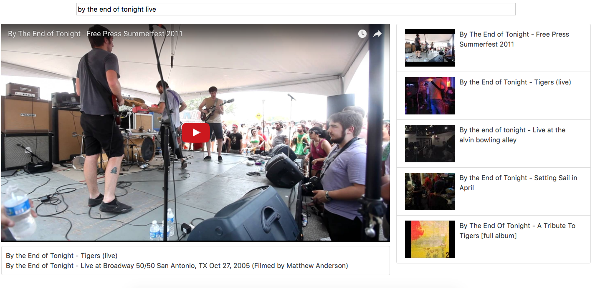

# Youtube Searcher
`Small project for getting acquainted with ES6 syntax for react. Search for a video and the 5 most relevant results with be displayed. Realtime search using react and youtube-api-search for AJAX requests.
`


```
clone repo
cd to directory
npm install
npm start

```
